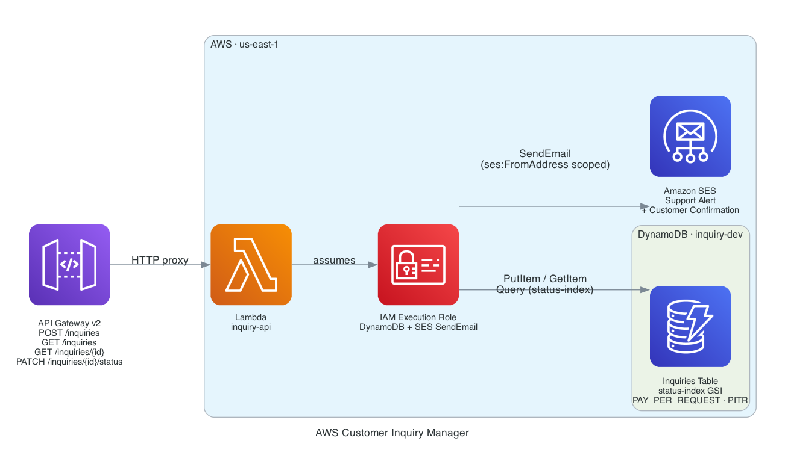

# AWS Customer Inquiry Manager

Terraform-managed AWS infrastructure that provisions a serverless customer inquiry API. Customers submit inquiries via HTTP POST; the Lambda handler stores the inquiry in DynamoDB, sends an internal notification to the support team via SES, and returns a confirmation email to the customer. Support agents can query by status, retrieve individual inquiries, and move them through a defined lifecycle with PATCH requests.

## Architecture



| Component | Resource | Purpose |
|---|---|---|
| API Gateway v2 | `api-inquiry-{env}` | HTTP API with four routes |
| Lambda | `lambda-inquiry-api-{env}` | Inquiry CRUD + SES notification dispatch |
| IAM Execution Role | `role-inquiry-lambda-{env}` | Least-privilege access to DynamoDB and SES |
| DynamoDB | `inquiry-{env}` | PAY_PER_REQUEST table with status GSI |
| SES | Email identity | Outbound notifications — new inquiries + customer confirmations |

## API Routes

| Method | Path | Description |
|---|---|---|
| `POST` | `/inquiries` | Submit a new inquiry — triggers SES notifications |
| `GET` | `/inquiries` | List inquiries — optional `?status=` filter |
| `GET` | `/inquiries/{id}` | Get a single inquiry |
| `PATCH` | `/inquiries/{id}/status` | Update status (`open`, `in-progress`, `resolved`, `closed`) |

## Features

- **Dual SES notifications** — support team alert + customer confirmation sent on every new inquiry
- **Status GSI** — DynamoDB Global Secondary Index on `status` + `created_at` enables efficient filtered queries
- **DynamoDB encryption** — AES-256 server-side encryption and point-in-time recovery enabled
- **Least-privilege IAM** — SES policy scoped to the specific sender address via `ses:FromAddress` condition
- **API Gateway v2** — HTTP API with per-route Lambda proxy integration
- **OIDC CI/CD** — GitHub Actions authenticates to AWS via OIDC federated identity, no stored credentials

## Prerequisites

- AWS account with SES in production mode (or both sender and recipient addresses verified for sandbox)
- S3 bucket for Terraform remote state (`tf-state-jordprojs` — see existing backend setup)
- Terraform >= 1.6
- AWS CLI

## Deploy

```bash
aws sso login   # or: export AWS_PROFILE=...

cd terraform
terraform init
terraform plan \
  -var="support_email=support@example.com" \
  -var="sender_email=noreply@example.com"
terraform apply \
  -var="support_email=support@example.com" \
  -var="sender_email=noreply@example.com"
```

> After applying, verify the sender email in SES before submitting inquiries. Check your inbox for the AWS verification email.

## Seed and Test

```bash
API=$(terraform output -raw api_endpoint)

# Submit inquiries and update status
bash ../scripts/seed_inquiries.sh "$API"

# Submit an inquiry manually
curl -X POST "$API/inquiries" \
  -H "Content-Type: application/json" \
  -d '{"name":"Jane Doe","email":"jane@example.com","subject":"Login issue","message":"I cannot log in after the password reset."}'

# Filter by status
curl "$API/inquiries?status=open"
```

## Variables

| Variable | Default | Description |
|---|---|---|
| `region` | `us-east-1` | AWS region |
| `environment` | `dev` | Environment tag suffix |
| `support_email` | required | Destination for new inquiry alerts |
| `sender_email` | required | Verified SES sender — used as the From: address |

## CI/CD

GitHub Actions deploys via OIDC (no stored credentials). Configure these repository secrets:

| Secret | Description |
|---|---|
| `AWS_ROLE_ARN` | IAM role ARN with OIDC trust for GitHub Actions |
| `SUPPORT_EMAIL` | Passed to `terraform plan -var` |
| `SENDER_EMAIL` | Passed to `terraform plan -var` |

Push to `main` triggers plan + apply. Pull requests run plan only.

## Outputs

| Output | Description |
|---|---|
| `api_endpoint` | HTTP API base URL |
| `table_name` | DynamoDB table name |
| `lambda_function_name` | Lambda function name |
| `lambda_execution_role_arn` | IAM execution role ARN |
| `ses_sender_identity` | Verified SES sender address |

## Tech Stack

- **Terraform** `>= 1.6` · `aws ~> 5.0` · `archive ~> 2.0`
- **AWS Lambda** (Python 3.12) — inquiry routing, DynamoDB writes, SES dispatch
- **Amazon DynamoDB** — PAY_PER_REQUEST, status GSI, AES-256 SSE, PITR enabled
- **Amazon SES** — transactional email with sender-scoped IAM condition
- **API Gateway v2** — HTTP API, payload format 2.0
- **AWS IAM** — least-privilege execution role with `ses:FromAddress` condition key
- **GitHub Actions** — OIDC federated auth, `aws-actions/configure-aws-credentials@v4`
